# 🏠 NYC Airbnb Room Type Prediction

<p align="center">
  
</p>

<p align="center">
  <a href="https://room-type-prediction-nyc-airbnb-xgew.onrender.com/">
    
  </a>
  <a href="https://github.com/anandpal3244-coder/Room-Type-Prediction-NYC-Airbnb">
    
  </a>
</p>

<p align="center">
  
  
  
  
  
</p>

---

## 🌐 Live Application

### 🚀 Try the deployed machine learning application

**👉 [Open NYC Airbnb Room Type Predictor](https://room-type-prediction-nyc-airbnb-xgew.onrender.com/)**

The application allows users to enter Airbnb listing information and receive:

* 🔮 Predicted room type
* 📊 Prediction probabilities
* 📍 Location-based inputs
* 🏠 Airbnb listing information
* 📈 Interactive prediction visualization

---

## 📸 Application Preview


```text
📁 Recommended GitHub structure

assets/
└── airbnb-demo.gif
```

After adding the GIF to your repository, use:

```html
<p align="center">
  
</p>
```

A GIF showing **entering data → clicking Predict → displaying the result** will make this repository much more attractive to recruiters.

---

# 📌 About The Project

**NYC Airbnb Room Type Prediction** is an end-to-end machine learning application built using the **NYC Airbnb Open Data** dataset.

The objective is to predict the type of Airbnb accommodation based on information about the listing's:

* Geographic location
* Price
* Minimum stay requirement
* Review activity
* Host listing count
* Availability

The machine learning model performs a **multi-class classification** task with three possible outcomes:

```text
Entire home/apt
Private room
Shared room
```

The trained model is saved as a reusable pipeline and integrated into a **FastAPI backend**.

A custom frontend built with **HTML, CSS and JavaScript** communicates with the API and presents the prediction in an interactive interface.

The complete application is deployed on **Render**.

---

# 🎯 Problem Statement

Airbnb listings contain many attributes related to location, pricing, reviews, host activity and availability.

The goal of this project is to determine whether these attributes can be used to predict the **room type** of an Airbnb listing.

### Machine Learning Problem

```text
Input
  ↓
Airbnb Listing Features
  ↓
Machine Learning Pipeline
  ↓
Multi-Class Classification
  ↓
Predicted Room Type
```

---

# ✨ Application Features

## 🔮 Room Type Prediction

The application predicts one of three room categories:

| Prediction         | Description                    |
| ------------------ | ------------------------------ |
| 🏠 Entire home/apt | Complete accommodation         |
| 🛏️ Private room   | Private room within a property |
| 🛋️ Shared room    | Shared accommodation           |

---

## 📊 Prediction Probability

Instead of displaying only the predicted class, the application also returns the model's probability distribution across the available classes.

Example response structure:

```json
{
  "Predicted_room_type": "Private room",
  "Probability": [
    0.12,
    0.81,
    0.07
  ]
}
```

This provides additional information about the model's prediction.

---

## 📍 Location Information

The application accepts geographic information including:

* Neighbourhood group
* Neighbourhood
* Latitude
* Longitude

This allows the model to use both **categorical and geographic numerical features**.

---

## 💰 Listing Information

Users can enter:

* Price
* Minimum nights
* Availability

These variables help describe the listing's booking characteristics.

---

## ⭐ Review & Host Information

The prediction also uses:

* Total number of reviews
* Reviews per month
* Calculated host listing count

---

# 🧠 Machine Learning Pipeline

The project uses a serialized **Scikit-learn Pipeline** stored in:

```text
Model_Pipeline.pkl
```

The pipeline is loaded by the FastAPI backend when the application starts.

### Model classes

```python
[
    "Entire home/apt",
    "Private room",
    "Shared room"
]
```

### Scikit-learn version used for the deployed model

```text
scikit-learn == 1.7.2
```

Keeping the deployed dependency version aligned with the model environment helps avoid model-loading compatibility problems.

---

# 📊 Features Used By The Model

| Feature                          | Type        | Description                        |
| -------------------------------- | ----------- | ---------------------------------- |
| `latitude`                       | Numerical   | Geographic latitude                |
| `longitude`                      | Numerical   | Geographic longitude               |
| `price`                          | Numerical   | Listing price                      |
| `minimum_nights`                 | Numerical   | Minimum number of nights           |
| `number_of_reviews`              | Numerical   | Total reviews                      |
| `reviews_per_month`              | Numerical   | Average monthly reviews            |
| `calculated_host_listings_count` | Numerical   | Number of listings managed by host |
| `availability_365`               | Numerical   | Available days during a year       |
| `neighbourhood_group`            | Categorical | NYC borough                        |
| `neighbourhood`                  | Categorical | NYC neighbourhood                  |

### Target

```text
room_type
```

---

# 🔄 End-to-End Workflow

```mermaid
flowchart LR

A[NYC Airbnb Dataset] --> B[Data Preparation]

B --> C[Feature Selection]

C --> D[ML Pipeline]

D --> E[Model Training]

E --> F[Model Pipeline]

F --> G[Model_Pipeline.pkl]

G --> H[FastAPI Backend]

H --> I[Prediction API]

I --> J[HTML CSS JavaScript Frontend]

J --> K[User Prediction]

K --> L[Render Deployment]
```



---

# 🏗️ Application Architecture

```text
                    ┌───────────────────────┐
                    │       User            │
                    │   Airbnb Input Data   │
                    └───────────┬───────────┘
                                │
                                ▼
                    ┌───────────────────────┐
                    │   Frontend Interface  │
                    │ HTML + CSS + JS       │
                    └───────────┬───────────┘
                                │
                         POST /predict
                                │
                                ▼
                    ┌───────────────────────┐
                    │     FastAPI API       │
                    │       main.py         │
                    └───────────┬───────────┘
                                │
                                ▼
                    ┌───────────────────────┐
                    │  Model_Pipeline.pkl  │
                    │   Scikit-learn       │
                    └───────────┬───────────┘
                                │
                                ▼
                    ┌───────────────────────┐
                    │   Prediction Result   │
                    │ Room Type + Prob.     │
                    └───────────────────────┘
```

---

# 🛠️ Technology Stack

### Programming

* 🐍 Python
* JavaScript
* HTML
* CSS

### Data Science

* Pandas
* NumPy
* Scikit-learn
* Joblib

### Backend

* FastAPI
* Uvicorn
* Pydantic

### Frontend

* HTML5
* CSS3
* JavaScript
* Canvas-based visualization

### Deployment & Version Control

* Render
* Git
* GitHub

---

# 📂 Project Structure

```text
Room-Type-Prediction-NYC-Airbnb/
│
├── 📄 main.py
├── 🤖 Model_Pipeline.pkl
├── 📄 requirements.txt
├── 📄 README.md
├── 📄 .gitignore
│
└── 📁 frontend/
    │
    ├── 📄 index.html
    ├── 🎨 style.css
    └── ⚡ script.js
```

---

# ⚙️ How The API Works

The frontend sends listing information to the FastAPI backend.

### Request

```http
POST /predict
```

The API receives the required Airbnb features and converts them into a DataFrame before passing them to the trained model.

### Response

```json
{
  "Predicted_room_type": "Entire home/apt",
  "Probability": [
    0.92,
    0.07,
    0.01
  ]
}
```

---

# 🔌 API Endpoints

| Endpoint   | Method | Purpose                       |
| ---------- | ------ | ----------------------------- |
| `/`        | GET    | Web application               |
| `/api`     | GET    | API health check              |
| `/predict` | POST   | Generate room type prediction |
| `/docs`    | GET    | FastAPI Swagger documentation |

### Production API Documentation

👉 **[Open Swagger API Docs](https://room-type-prediction-nyc-airbnb-xgew.onrender.com/docs)**

---

# 💻 Run The Project Locally

## 1️⃣ Clone the repository

```bash
git clone https://github.com/anandpal3244-coder/Room-Type-Prediction-NYC-Airbnb.git
```

## 2️⃣ Enter the project directory

```bash
cd Room-Type-Prediction-NYC-Airbnb
```

## 3️⃣ Create a virtual environment

```bash
python -m venv venv
```

## 4️⃣ Activate the environment

### Windows

```powershell
venv\Scripts\activate
```

## 5️⃣ Install dependencies

```bash
pip install -r requirements.txt
```

## 6️⃣ Start FastAPI

```bash
uvicorn main:app --reload
```

## 7️⃣ Open the application

```text
http://127.0.0.1:8000
```

---

# 📦 Requirements

The deployed application uses:

```text
fastapi
uvicorn
pandas
numpy
scikit-learn==1.7.2
joblib
```

---

# ☁️ Deployment

The application is deployed as a **Render Web Service**.

### Deployment architecture

```text
GitHub Repository
       │
       ▼
     Render
       │
       ▼
   FastAPI Server
       │
       ├── Frontend
       ├── API
       └── ML Model
```

A separate Render Static Site is not required because the FastAPI Web Service serves the frontend as well as the prediction API.

### 🚀 Production URL

**https://room-type-prediction-nyc-airbnb-xgew.onrender.com/**

---

# 🔐 Why A Model Pipeline?

Instead of manually reproducing preprocessing steps inside the API, the project stores the preprocessing and prediction workflow together as a Scikit-learn pipeline.

This provides a cleaner deployment flow:

```text
Raw User Input
      ↓
Preprocessing
      ↓
Feature Transformation
      ↓
Model
      ↓
Prediction
```

The API only needs to load:

```text
Model_Pipeline.pkl
```

and send the prepared input to the pipeline.

---

# 🧪 Testing The Application

The application can be tested through:

### Browser

```text
/
```

### API Health Check

```text
/api
```

### Interactive API Documentation

```text
/docs
```

The Swagger interface can also be used to test the prediction endpoint directly.

---

# 📚 Key Learning Outcomes

Building this project helped me understand the complete path from a machine learning model to a deployed application.

### Data Science

* Working with real-world Airbnb data
* Selecting relevant features
* Handling numerical and categorical variables
* Building classification workflows
* Understanding prediction probabilities

### Machine Learning

* Scikit-learn pipelines
* Model serialization
* Model inference
* Multi-class classification

### Backend Development

* FastAPI
* REST API endpoints
* Pydantic request validation
* Serving machine learning predictions

### Frontend Development

* HTML
* CSS
* JavaScript
* API integration
* Interactive UI

### Deployment

* Git/GitHub workflow
* Dependency management
* Render deployment
* Debugging production deployment issues

---

# 🚧 Challenges Solved

During deployment, several practical issues were encountered and resolved, including:

* Dependency compatibility
* Scikit-learn model version matching
* FastAPI frontend serving
* Static file paths
* Render deployment configuration
* Git repository configuration
* Production model loading
* Frontend-to-backend API communication

These deployment issues were useful because they demonstrated that a machine learning project involves more than simply training a model in a notebook.

---

# 🔮 Future Improvements

Potential improvements for the next version include:

* 📊 Add model evaluation metrics to the application
* 📈 Add an EDA dashboard
* 🗺️ Improve geographic visualization
* 🔍 Add model comparison
* 📉 Add confusion matrix visualization
* 🔄 Add automated model retraining
* 📡 Add production monitoring
* 📱 Improve mobile responsiveness
* 🧪 Add automated API tests
* 🐳 Add Docker support
* ⚡ Improve cold-start experience on free hosting

---

# 🎓 What This Project Demonstrates

This project demonstrates an **end-to-end machine learning workflow**:

```text
Data
 ↓
Feature Preparation
 ↓
Machine Learning
 ↓
Model Pipeline
 ↓
API
 ↓
Frontend
 ↓
Cloud Deployment
```

Rather than keeping the model inside a Jupyter Notebook, the trained model is exposed through a real web application that users can interact with.

---

# 👨‍💻 Author

## Anand Kumar

**Aspiring Data Analyst → Data Scientist**

Interested in:

* Data Analytics
* Machine Learning
* Python
* SQL
* Data Visualization
* Applied Data Science

### 🔗 Connect With Me

<p>
  <a href="https://www.linkedin.com/in/anand-pal-6a657b393/">
    
  </a>
  <a href="https://github.com/anandpal3244-coder">
    
  </a>
</p>

---

# ⭐ Support

If you found this project useful or interesting, consider giving the repository a ⭐.

<p align="center">
  <b>Built with 🐍 Python · 🤖 Machine Learning · ⚡ FastAPI · 🌐 JavaScript · ☁️ Render</b>
</p>

<p align="center">
  <i>Turning machine learning models into usable applications.</i>
</p>
